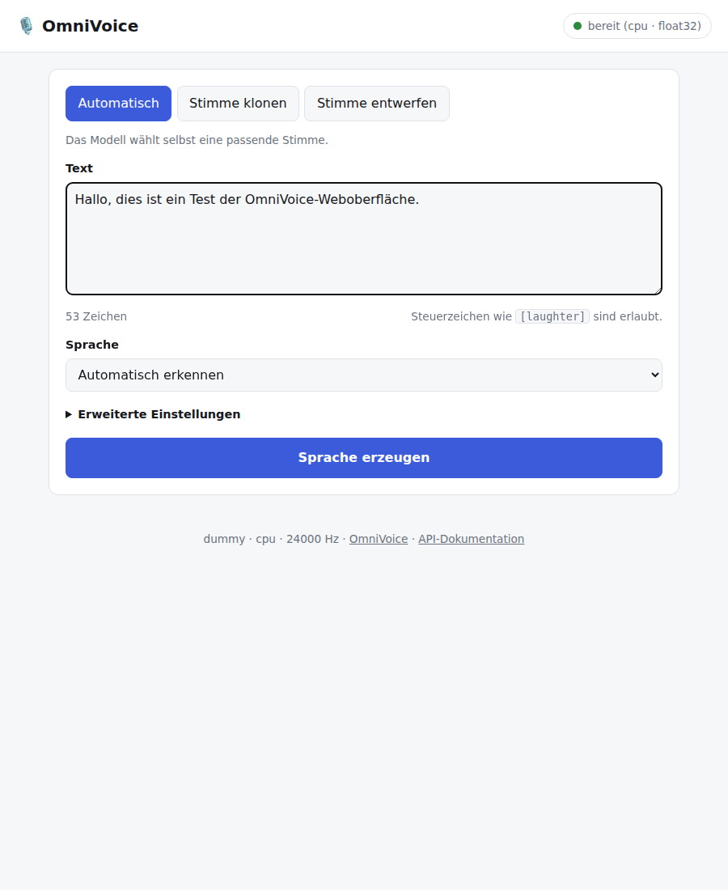
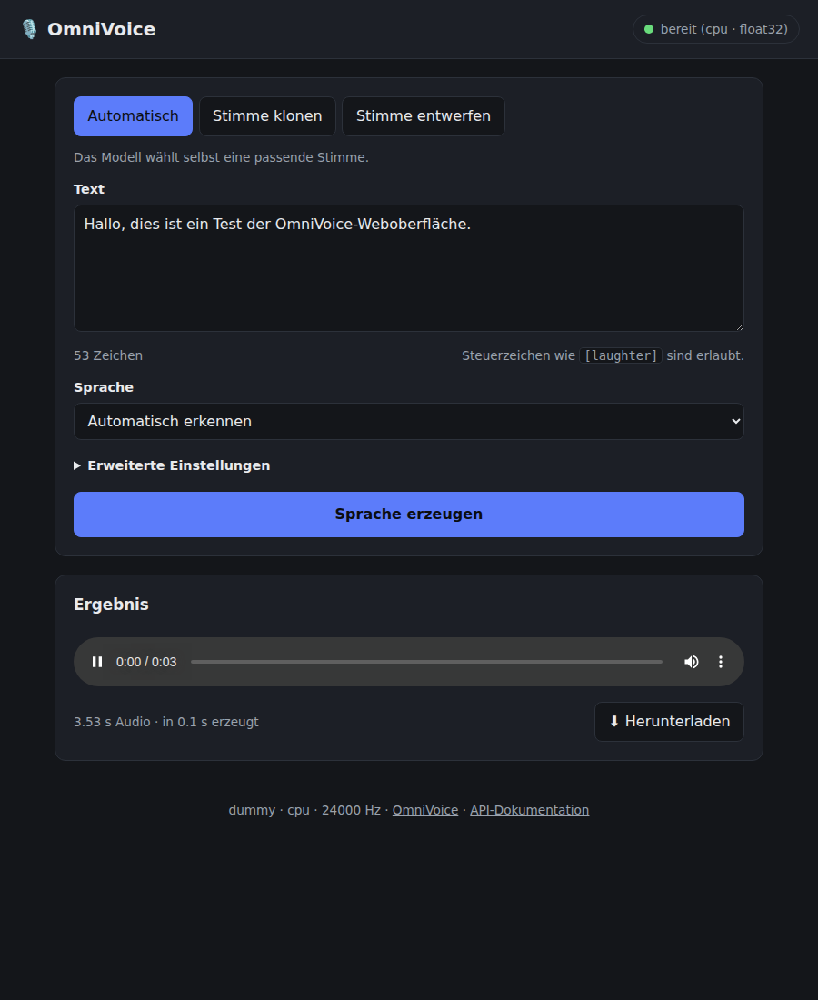
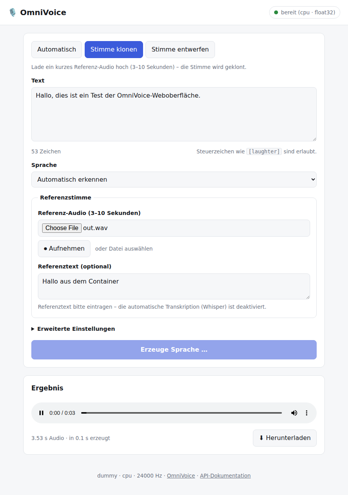

# OmniVoice im Docker-Container

[OmniVoice](https://github.com/k2-fsa/OmniVoice) ist ein mehrsprachiges
Zero-Shot-TTS-Modell (600+ Sprachen, Stimmklonen, Stimm-Design). Dieses
Repository verpackt es so, dass es **mit einem Befehl als Docker-Container auf
dem eigenen Laptop läuft** – inklusive kleiner Weboberfläche und REST-API.

* Ein Befehl zum Starten, alles läuft lokal.
* **Stimm-Bibliothek**: Personen mit Bild, Name, Referenzaufnahme und
  Referenztext anlegen und immer wieder verwenden – oder wie bisher ohne
  gespeicherte Stimme erzeugen.
* **Referenz aus einem YouTube-Link**: Video laden, beim Anhören Start und
  Ende setzen – der Ausschnitt wird als MP3 hinterlegt, das Transkript des
  Videos landet im Referenztext. Dazu ein Knopf, der ein Bild zur Person im
  Internet sucht.
* **Kein Hugging-Face-API-Key nötig** ([warum](#brauche-ich-einen-hugging-face-token)).
* CPU-Standard (läuft auf jedem Laptop), NVIDIA-GPU per Override-Datei.
* Dauerprognose: die Oberfläche zeigt vorab und während der Erzeugung, wie
  lange es voraussichtlich noch dauert – gelernt aus den bisherigen Läufen
  auf dem eigenen Rechner.
* Modellgewichte und Stimm-Bibliothek liegen als normale Ordner auf dem
  Rechner (`models/` und `data/`) – sichtbar, sicherbar, nur einmal geladen.
* Smoke-Test-Modus, mit dem sich der Container ohne Modell-Download prüfen lässt.

| Hell | Dunkel |
| --- | --- |
|  |  |

> Die Screenshots stammen aus dem Smoke-Test-Modus (`OMNIVOICE_ENGINE=dummy`),
> deshalb steht in der Fußzeile `dummy`.

---

## Schnellstart

Voraussetzung: Docker Desktop bzw. Docker Engine mit Compose v2.

```bash
git clone https://github.com/NilsBaumgartner1994/omni-voice.git
cd omni-voice
docker compose up -d --build
```

Danach im Browser öffnen: **<http://localhost:7860>**

Dabei werden zwei Ordner im Repository gefüllt:

| Ordner | Inhalt |
| --- | --- |
| `models/` | Modellgewichte (mehrere GB, werden einmal geladen) |
| `data/voices/` | Stimm-Bibliothek: Personen, Bilder, Aufnahmen, Texte |

Beide gehören dem eigenen Benutzerkonto und lassen sich ganz normal sichern
oder verschieben (andere Pfade: `OMNIVOICE_MODELS_PATH` / `OMNIVOICE_DATA_PATH`
in der `.env`). `docker compose down` – auch mit `-v` – fasst sie nicht an.

Beim **ersten** Start lädt der Container die Modellgewichte von Hugging Face
(mehrere GB). Solange zeigt die Oberfläche „Modell wird geladen …“. Fortschritt:

```bash
docker compose logs -f
```

Alternativ die Gewichte vorher gezielt laden:

```bash
docker compose run --rm omnivoice prefetch
```

Wer `make` hat, kann alles darüber steuern – `make help` zeigt die Befehle.

---

## Brauche ich einen Hugging-Face-Token?

**Nein.** Alle benötigten Repositories sind öffentlich und werden anonym
heruntergeladen:

| Repository | Wofür | Zugriff |
| --- | --- | --- |
| `k2-fsa/OmniVoice` | TTS-Modell | öffentlich |
| `eustlb/higgs-audio-v2-tokenizer` | Audio-Tokenizer (nur falls nicht im Hauptmodell enthalten) | öffentlich |
| `openai/whisper-large-v3-turbo` | **optional**, nur für automatische Transkription der Referenzstimme | öffentlich |

Es wird nirgends ein Token gesetzt oder gelesen. Falls `huggingface.co` in
deinem Netz nicht erreichbar ist, hilft ein Spiegel statt eines Tokens:

```bash
echo 'HF_ENDPOINT=https://hf-mirror.com' >> .env
docker compose up -d
```

Für den vollständig abgeschotteten Betrieb: einmal `prefetch` laufen lassen und
danach `HF_HUB_OFFLINE=1` in der `.env` setzen – dann geht der Container gar
nicht mehr ins Netz.

---

## Die Weboberfläche

Vier Modi:

1. **Automatisch** – nur Text eingeben, das Modell wählt eine Stimme.
2. **Gespeicherte Stimme** – eine Person aus der Bibliothek auswählen
   (siehe unten).
3. **Einmalige Referenz** – Referenz-Audio (3–10 s) hochladen oder direkt im
   Browser aufnehmen, ohne es zu speichern. Der Referenztext ist optional,
   siehe Hinweis unten.
4. **Stimme entwerfen** – Stimme über Eigenschaften beschreiben (Geschlecht,
   Alter, Tonhöhe, Flüstern, englischer Akzent, chinesischer Dialekt).

Unter „Erweiterte Einstellungen“ lassen sich Tempo, Diffusionsschritte,
Guidance-Scale und eine feste Audiolänge einstellen. Steuerzeichen aus OmniVoice
wie `[laughter]` oder `[B EY1 S]` funktionieren direkt im Text.

Neben „Sprache erzeugen“ steht der Schalter **„Automatisch abspielen“**: ist er
gesetzt (Voreinstellung), läuft das Ergebnis los, sobald es fertig ist. Wer beim
Erzeugen nebenbei etwas anderes hört, nimmt den Haken weg – die Aufnahme landet
trotzdem im Ergebnis-Player und im Download.

Im Ergebnis steht neben „Herunterladen“ ein Auswahlfeld für das **Dateiformat**:
**MP3** (Voreinstellung, rund zehnmal kleiner) oder **WAV** (unkomprimiert).
Erzeugt wird immer WAV; das MP3 rechnet der Server einmal daraus um, eine zweite
Synthese kostet es also nicht. Fehlt ffmpeg (nur außerhalb des Containers
möglich), bleibt WAV als einzige Auswahl stehen.

### Die Stimm-Bibliothek

Unten auf der Seite steht die Bibliothek als **Bilderleiste**: pro Person nur
das Bild mit dem Namen darunter – ohne hinterlegtes Bild der Anfangsbuchstabe.
Ein **grüner Ring** um das Bild heißt „für das geladene Modell berechnet“, ohne
Ring fehlt die Berechnung noch.

„＋ Person anlegen“ öffnet das Formular für eine neue Person: Name, Bild
(optional), Referenz-Audio und der zugehörige Referenztext. Danach steht die
Person im Tab „Gespeicherte Stimme“ zur Auswahl – Text eintippen, erzeugen,
fertig.

**Referenzaufnahme aus einem YouTube-Video.** Statt eine Datei hochzuladen,
lässt sich unter „Referenz-Audio“ auf „YouTube-Link“ umschalten:

1. Link einfügen und auf „Laden“ klicken. Der Server holt die Tonspur des
   Videos als MP3 und – wenn es welche gibt – die Untertitel dazu. Beides
   liegt in `data/youtube-cache/` und wird nur zum Auswählen gebraucht.
2. Das Video im Player anhören und mit „⏱ Start hier“ und „⏱ Ende hier“ den
   Ausschnitt setzen – das geht **während der Wiedergabe**; die Sekunden
   lassen sich daneben von Hand nachbessern. „▶ Ausschnitt anhören“ spielt
   genau den gewählten Bereich und hält am Ende an.
3. Das Transkript des Ausschnitts steht darunter und wandert automatisch in
   den Referenztext (solange dort nichts Eigenes steht); „Als Referenztext
   übernehmen“ setzt es von Hand. Hat das Video keine Untertitel, bleibt das
   Feld leer: dann wird der Text selbst eingetippt – oder, mit
   `OMNIVOICE_LOAD_ASR=true`, beim Vorbereiten von Whisper erkannt.

Gespeichert wird beim Klick auf „Speichern“ nur der Ausschnitt: der Server
schneidet ihn mit ffmpeg aus der geladenen Tonspur und legt ihn als
`reference.mp3` bei der Person ab. Woher er stammt (Link, Titel, Start und
Ende), steht in ihrer `voice.json` und in den Details als Link zurück auf die
Stelle im Video. Standardgrenzen: Video höchstens 60 Minuten, Ausschnitt
höchstens 120 Sekunden (`OMNIVOICE_YOUTUBE_MAX_*`).

**Bild suchen.** Neben dem Namensfeld sucht „🔍 Bild suchen“ ein Bild zur
Person bei Wikipedia und Wikimedia Commons – ohne Zugangsschlüssel, mit
Angabe von Herkunft und Lizenz unter jedem Treffer. Ein Klick wählt ein Bild
aus; heruntergeladen wird es erst beim Speichern (und nur von
`upload.wikimedia.org`). Ist nichts Passendes dabei, führen die Links
darunter in die Bildersuche von DuckDuckGo, Google und Bing – von dort wird
das Bild wie gewohnt als Datei ausgewählt.

Ein **Klick auf eine Person** öffnet ihre Details: Referenzaufnahme anhören,
Name, Bild, Aufnahme, Referenztext und Notiz ändern – und die Knöpfe
„Verwenden“, „Vorbereiten“ bzw. „Neu berechnen“ und „Löschen“.

Neu angelegte Personen werden gleich vorbereitet („Stimme direkt für dieses
Modell vorbereiten“, voreingestellt); das Anlegen dauert dadurch etwas länger,
dafür läuft der erste Auftrag sofort los. Ohne Haken – oder wenn die
Berechnung scheitert, etwa weil das Modell noch lädt – bleibt die Person
trotzdem gespeichert, und die Stimme entsteht beim ersten Auftrag oder per
„Vorbereiten“ (bzw. „Alle für dieses Modell vorbereiten“).

**Modellwechsel:** Quelldaten und Berechnetes liegen getrennt:

```
/data/voices/<person>/voice.json          Name, Referenztext, Notiz, Herkunft
/data/voices/<person>/reference.wav       Referenzaufnahme (aus YouTube: .mp3)
/data/voices/<person>/portrait.jpg        Bild
/data/voices/<person>/derived/<key>.bin   vom Modell berechnete Stimme
/data/youtube-cache/<video-id>/           geladene Tonspur, jederzeit löschbar
```

Nur der `derived/`-Teil hängt am Modell. Wird ein anderes Modell (oder eine
andere Rechengenauigkeit) geladen, ändert sich der Schlüssel: die Oberfläche
zeigt die Stimmen dann als „noch nicht berechnet“, und ein Klick auf
„Alle für dieses Modell vorbereiten“ erzeugt sie neu. Personen, Bilder,
Aufnahmen und Texte bleiben dabei unangetastet. Dasselbe passiert automatisch,
wenn für eine Person ein neues Referenz-Audio oder ein neuer Referenztext
hinterlegt wird.

Die Bibliothek liegt im Ordner `data/` auf dem Rechner, getrennt von den
Gewichten in `models/`. Ein Backup ist damit ein simples Kopieren des Ordners;
zum Umziehen auf einen anderen Rechner reicht es, `data/` mitzunehmen und die
Stimmen dort einmal vorbereiten zu lassen.

### Wie lange dauert das noch?

Auf einer CPU dauert die Synthese je nach Text von Sekunden bis Minuten, und das
Modell meldet dabei keinen Fortschritt. Deshalb misst der Server jeden fertigen
Auftrag und schätzt daraus die Dauer des nächsten: unter dem Knopf steht vorab
„Voraussichtliche Dauer: ca. 45 s“, während der Erzeugung laufen Fortschritts-
balken und „noch ca. …“ mit, danach zeigt das Ergebnis die tatsächliche Dauer
neben der Prognose.

Die Schätzung ist keine feste Zeit pro Auftrag, sondern eine gelernte
Geschwindigkeit (Sekunden pro Arbeitseinheit), hochgerechnet auf die aktuelle
Eingabe:

```
Arbeit = Diffusionsschritte × Audiolänge × (2 bei Guidance > 0)
```

Die Audiolänge kommt aus der festen Länge, sonst aus Textlänge und Tempo. Ein
einziger vorheriger Lauf reicht damit schon für eine brauchbare Schätzung *einer
anderen* Eingabe: 60 s für einen Text ergeben rund 30 s für den halb so langen.
Als Rate dient der Median der letzten Läufe, ein einzelner Ausreißer (anderes
Programm hat die CPU blockiert) verzerrt sie also nicht.

Die Historie hängt an Engine, Modell, Gerät und dtype – nach einem Wechsel von
CPU auf GPU wird also neu gelernt statt falsch geschätzt. Sie liegt im
Modell-Ordner (`models/generation-timings.json`) und überlebt damit einen
Neustart des Containers.



**Hinweis zum Referenztext:** Ohne Referenztext transkribiert OmniVoice das
Referenz-Audio automatisch mit Whisper. Dieses Modell ist ein zusätzlicher
Download von mehreren GB und deshalb standardmäßig **aus**. Entweder den
Referenztext eintippen – oder in der `.env`:

```env
OMNIVOICE_LOAD_ASR=true
# für Laptops sparsamer:
OMNIVOICE_ASR_MODEL=openai/whisper-small
```

### Die originale Gradio-Oberfläche

Die Oberfläche aus dem Upstream-Projekt ist ebenfalls eingebaut:

```bash
docker compose down          # Port freigeben
docker compose run --rm --service-ports omnivoice gradio
```

Sie wird über einen eigenen Starter geladen, weil `omnivoice-demo` das dtype
fest auf `float16` setzt – auf einer CPU ist das unbrauchbar langsam bzw. für
einige Operationen gar nicht implementiert. Der Starter wählt Gerät und dtype
passend zur Maschine und benutzt ansonsten exakt die Upstream-Oberfläche.

---

## REST-API

| Methode | Pfad | Zweck |
| --- | --- | --- |
| `GET` | `/api/health` | Ladezustand (`200` = bereit, `503` = lädt noch) |
| `GET` | `/api/info` | Gerät, dtype, Limits, Stimm-Eigenschaften |
| `GET` | `/api/languages` | Liste der unterstützten Sprachen |
| `GET` | `/api/estimate` | Dauerprognose für die angegebenen Einstellungen |
| `POST` | `/api/tts` | Synthese, Antwort ist eine WAV- oder MP3-Datei |
| `POST` | `/api/convert` | fertiges WAV in ein anderes Format umrechnen (`audio`, `format`) |
| `GET` | `/api/voices` | Stimm-Bibliothek auflisten (inkl. „berechnet?“) |
| `POST` | `/api/voices` | Person anlegen (multipart: `name`, `ref_audio`, `ref_text`, `image`, …; `prepare=false` überspringt das Berechnen) |
| `GET` `POST` `DELETE` | `/api/voices/{id}` | einzelne Person lesen, ändern, löschen |
| `GET` | `/api/voices/{id}/audio` · `/image` | hinterlegte Dateien |
| `POST` | `/api/voices/{id}/prepare` | Stimme für das geladene Modell berechnen |
| `POST` | `/api/voices/prepare-all` | alle Stimmen berechnen (nach Modellwechsel) |
| `GET` | `/docs` | interaktive OpenAPI-Dokumentation |

`/api/tts` akzeptiert JSON oder `multipart/form-data` (für das Referenz-Audio):

```bash
# Einfachster Fall
curl -X POST http://localhost:7860/api/tts \
  -H 'content-type: application/json' \
  -d '{"text": "Hallo, das läuft komplett auf meinem Laptop."}' \
  -o hallo.wav

# Stimme entwerfen
curl -X POST http://localhost:7860/api/tts \
  -H 'content-type: application/json' \
  -d '{"text": "Guten Morgen!", "mode": "design",
       "instruct": "female, low pitch", "language": "German"}' \
  -o design.wav

# Stimme klonen
curl -X POST http://localhost:7860/api/tts \
  -F text="Das ist meine geklonte Stimme." \
  -F mode=clone \
  -F ref_audio=@referenz.wav \
  -F ref_text="Transkript der Referenzaufnahme." \
  -o klon.wav
```

Felder: `text` (Pflicht), `mode` (`auto` | `clone` | `design`), `voice_id`,
`language`, `instruct`, `ref_audio`, `ref_text`, `num_step`, `guidance_scale`,
`speed`, `duration`, `denoise`, `normalize_text`, `format`.

`format` ist `wav` (Standard) oder `mp3`; die Bitrate steuert
`OMNIVOICE_MP3_BITRATE`. Ein schon erzeugtes WAV lässt sich auch ohne neue
Synthese umwandeln – genau das macht die Weboberfläche beim Herunterladen:

```bash
# gleich als MP3 erzeugen
curl -X POST http://localhost:7860/api/tts \
  -H 'content-type: application/json' \
  -d '{"text": "Hallo!", "format": "mp3"}' \
  -o hallo.mp3

# oder ein vorhandenes WAV umwandeln
curl -X POST http://localhost:7860/api/convert \
  -F audio=@hallo.wav -F format=mp3 -o hallo.mp3
```

MP3 kodiert ffmpeg, das im Image enthalten ist. Fehlt es (Entwicklung ohne
Docker), antwortet `format=mp3` mit `503`; `/api/info` listet unter
`audio_formats` die tatsächlich verfügbaren Formate.

Mit einer gespeicherten Person genügt deren `voice_id` – Referenzaufnahme und
Referenztext kommen dann aus der Bibliothek:

```bash
# Person anlegen
curl -X POST http://localhost:7860/api/voices \
  -F name="Anna Beispiel" \
  -F ref_text="Transkript der Referenzaufnahme." \
  -F ref_audio=@referenz.wav \
  -F image=@anna.jpg
# Die Stimme wird dabei gleich berechnet (`-F prepare=false` überspringt das):
# {"id": "anna-beispiel-a1b2c3", "prepared": true, ...}

# und benutzen
curl -X POST http://localhost:7860/api/tts \
  -F text="Hallo, hier spricht Anna." \
  -F voice_id=anna-beispiel-a1b2c3 \
  -o anna.wav
```

Die Referenzaufnahme darf auch aus einem YouTube-Video kommen. Erst das Video
laden (Tonspur + Untertitel), dann die Person mit Zeitmarken anlegen:

```bash
# Video holen: Antwort enthält Länge, Transkript mit Zeitmarken und die
# Adresse der Tonspur zum Anhören (/api/youtube/<id>/audio).
curl -X POST http://localhost:7860/api/youtube/fetch \
  -H 'content-type: application/json' \
  -d '{"url":"https://www.youtube.com/watch?v=..."}'

# Transkript eines Ausschnitts nachschlagen
curl 'http://localhost:7860/api/youtube/<video-id>/transcript?start=12&end=22'

# Person daraus anlegen: der Server schneidet 12–22 s als MP3 heraus und
# übernimmt das Transkript als Referenztext, wenn keiner mitgeschickt wird.
curl -X POST http://localhost:7860/api/voices \
  -F name="Anna Beispiel" \
  -F youtube_url="https://www.youtube.com/watch?v=..." \
  -F youtube_start=12 \
  -F youtube_end=22
```

Ein Bild zum Namen findet `/api/image-search`; übernommen wird es beim
Anlegen oder Bearbeiten über `image_url` (nur Treffer der Suche):

```bash
curl 'http://localhost:7860/api/image-search?q=Anna%20Beispiel'
# {"count": 3, "results": [{"title": "...", "url": "https://upload.wikimedia.org/...",
#   "thumbnail": "...", "credit": "Wikimedia Commons · ... · CC BY-SA 4.0"}], ...}

curl -X POST http://localhost:7860/api/voices/anna-beispiel-a1b2c3 \
  -F image_url="https://upload.wikimedia.org/..."
```

Ob dieser Server beides kann, steht in `/api/info` unter `youtube` und
`image_search` (jeweils mit `enabled` und – falls nicht – dem Grund).

Die Antwort trägt die tatsächliche Rechenzeit im Header
`X-OmniVoice-Generation-Seconds` (und die Audiolänge in
`X-OmniVoice-Duration-Seconds`).

`/api/estimate` beantwortet dieselbe Frage vorab – Parameter sind `text_chars`,
`num_step`, `guidance_scale`, `speed`, `duration` und `mode`:

```bash
curl 'http://localhost:7860/api/estimate?text_chars=280&num_step=32'
# {"estimate_seconds": 46.2, "low_seconds": 41.0, "high_seconds": 52.7,
#  "samples": 7, "based_on": "mode", "audio_seconds": 18.7, "history": {...}}
```

Solange noch kein Auftrag gelaufen ist, ist `estimate_seconds` `null`.

---

## Konfiguration

Alles über Umgebungsvariablen. Die `.env` im Projektordner ist bereits mit
den Standardwerten eingecheckt – dort anpassen, danach `docker compose up -d`:

| Variable | Standard | Bedeutung |
| --- | --- | --- |
| `OMNIVOICE_PORT` | `7860` | Port auf dem Host |
| `OMNIVOICE_MODEL` | `k2-fsa/OmniVoice` | Modell (HF-Repo oder Pfad im Container) |
| `OMNIVOICE_DEVICE` | `cpu` | `cpu`, `cuda`, `mps`, `xpu`; leer = automatisch |
| `OMNIVOICE_DTYPE` | leer | leer = `float32` auf CPU, `float16` auf GPU |
| `OMNIVOICE_LOAD_ASR` | `false` | Whisper für automatische Transkription laden |
| `OMNIVOICE_ASR_MODEL` | `openai/whisper-large-v3-turbo` | verwendetes Whisper-Modell |
| `OMNIVOICE_MAX_TEXT_CHARS` | `2000` | Längenlimit pro Anfrage |
| `OMNIVOICE_MP3_BITRATE` | `192k` | Bitrate der MP3-Downloads |
| `OMNIVOICE_MAX_CONVERT_BYTES` | `67108864` | Obergrenze für `/api/convert` |
| `OMNIVOICE_ENGINE` | `omnivoice` | `dummy` = Testton ohne Modell |
| `OMNIVOICE_MODELS_PATH` | `./models` | Ordner für die Modellgewichte |
| `OMNIVOICE_DATA_PATH` | `./data` | Ordner für die Stimm-Bibliothek |
| `OMNIVOICE_LIBRARY_DIR` | `/data/voices` | Verzeichnis der Stimm-Bibliothek im Container |
| `OMNIVOICE_MAX_IMAGE_BYTES` | `5242880` | Obergrenze für hinterlegte Bilder |
| `OMNIVOICE_VOICE_CACHE_SIZE` | `8` | berechnete Stimmen gleichzeitig im RAM |
| `OMNIVOICE_YOUTUBE` | `true` | Referenzaufnahme aus einem YouTube-Link erlauben |
| `OMNIVOICE_YOUTUBE_CACHE_DIR` | `/data/youtube-cache` | Zwischenspeicher der geladenen Tonspuren |
| `OMNIVOICE_YOUTUBE_CACHE_ENTRIES` | `5` | wie viele Videos dort liegen bleiben |
| `OMNIVOICE_YOUTUBE_MAX_VIDEO_SECONDS` | `3600` | Längengrenze für ein verlinktes Video |
| `OMNIVOICE_YOUTUBE_MAX_CLIP_SECONDS` | `120` | Längengrenze für den Ausschnitt |
| `OMNIVOICE_YOUTUBE_TIMEOUT` | `600` | Abbruch, wenn yt-dlp so lange braucht |
| `OMNIVOICE_YTDLP` | leer | anderer Pfad zu `yt-dlp` |
| `OMNIVOICE_IMAGE_SEARCH` | `true` | Bildersuche zum Namen (Wikipedia/Commons) |
| `OMNIVOICE_IMAGE_SEARCH_LANGUAGE` | `de` | Sprachausgabe der Wikipedia-Suche |
| `OMNIVOICE_TIMING_HISTORY` | `/models/generation-timings.json` | Datei mit den gemessenen Laufzeiten (Basis der Dauerprognose) |
| `OMNIVOICE_TIMING_HISTORY_SIZE` | `200` | Wie viele Läufe gespeichert bleiben |
| `OMP_NUM_THREADS` | leer | CPU-Threads begrenzen |
| `HF_ENDPOINT` | leer | Spiegelserver für Hugging Face |
| `HF_HUB_OFFLINE` | leer | `1` = keine Netzwerkzugriffe mehr |

Modellgewichte (`models/` → `/models`) und Stimm-Bibliothek (`data/` →
`/data`) sind normale Ordner im Projekt und überleben jedes `docker compose down`,
auch mit `-v`. `make clean-models` löscht nur die Gewichte und erzwingt damit
einen Neu-Download; die Stimmen bleiben stehen.

Wer schon vor dieser Änderung gestartet ist, hat die Gewichte noch im alten
Docker-Volume. Statt sie neu zu laden, einmal umkopieren:

```bash
docker compose down
mkdir -p models
docker run --rm -v omnivoice-models:/from -v "$PWD/models":/to \
  alpine sh -c 'cp -a /from/. /to/'
docker compose up -d
```

---

## GPU, Apple Silicon und Geschwindigkeit

**NVIDIA-GPU** (mit installiertem NVIDIA Container Toolkit):

```bash
docker compose -f docker-compose.yml -f docker-compose.gpu.yml up -d --build
```

Damit wird dasselbe Image mit CUDA-PyTorch gebaut, die GPU durchgereicht und
`float16` verwendet. Eine andere CUDA-Version lässt sich über
`TORCH_INDEX_URL_CUDA` in der `.env` wählen.

**Apple Silicon (M1–M4):** Docker Desktop kann die Apple-GPU nicht an Container
weiterreichen; im Container läuft OmniVoice deshalb auf der CPU. Wer die
`mps`-Beschleunigung will, muss OmniVoice nativ auf dem Mac installieren
(siehe Upstream-README) – der Container bleibt trotzdem der einfachste Weg zum
Ausprobieren.

**Tempo:** Auf einer Laptop-CPU ist die Synthese deutlich langsamer als in
Echtzeit; wie viel genau, hängt stark von CPU und Kernanzahl ab. Was hilft:

* „Diffusionsschritte“ von 32 auf 16 senken (schneller, minimal weniger Qualität),
* kurze Texte statt langer Absätze,
* `OMP_NUM_THREADS` auf die Anzahl der physischen Kerne setzen,
* `OMNIVOICE_LOAD_ASR=false` lassen (spart RAM und Download).

Der Container braucht mehrere GB RAM. Unter Docker Desktop ggf. das
Speicherlimit erhöhen (Settings → Resources), sonst wird der Prozess beim Laden
des Modells mit Exit-Code 137 (OOM) beendet.

---

## Ohne Docker entwickeln

```bash
pip install -r requirements-dev.txt
OMNIVOICE_ENGINE=dummy PYTHONPATH=source \
  python -m omnivoice_server --port 7860        # nur UI/API
```

Mit echtem Modell zusätzlich `pip install omnivoice torch torchaudio` und
`OMNIVOICE_ENGINE=omnivoice`.

## Tests

```bash
make test     # pytest, ohne Docker und ohne Modell-Download
make smoke    # baut den Container und prüft ihn mit der Dummy-Engine
```

Der Smoke-Test startet den Container mit `OMNIVOICE_ENGINE=dummy`, wartet auf
`/api/health`, ruft die Oberfläche ab und erzeugt eine WAV-Datei. Damit lässt
sich Port-, Volume- und Proxy-Konfiguration in Sekunden prüfen, ohne erst
mehrere GB herunterzuladen.

---

## Troubleshooting

| Symptom | Ursache / Lösung |
| --- | --- |
| Oberfläche zeigt dauerhaft „Modell wird geladen …“ | Erster Download läuft; `docker compose logs -f` zeigt den Fortschritt |
| Container wird mit Exit 137 beendet | Zu wenig RAM für Docker – Limit in Docker Desktop erhöhen |
| „Ohne Referenztext wird ein Whisper-ASR-Modell benötigt …“ | Referenztext eintragen oder `OMNIVOICE_LOAD_ASR=true` setzen |
| Download bricht ab / hängt | `HF_ENDPOINT=https://hf-mirror.com` in die `.env` |
| „Fehler beim Laden“ + `UnsupportedProtocol: Request URL is missing an 'http://' …` | `HF_ENDPOINT` ist leer gesetzt. Zeile aus der `.env` entfernen oder auf eine vollständige URL setzen, danach `docker compose up -d` |
| Port 7860 belegt | `OMNIVOICE_PORT=8080` in die `.env` |
| Prognose bleibt „noch unbekannt“ | Es ist noch kein Auftrag durchgelaufen (oder Gerät/Modell wurde gewechselt – die Historie startet dann neu) |
| „Permission denied“ auf `/models` oder `/data` (Linux) | Ordner gehören root. `sudo chown -R 1000:1000 models data` – der Container läuft als UID 1000 |
| Gewichte werden erneut heruntergeladen | Sie liegen noch im alten Docker-Volume; siehe „Konfiguration“ zum Umkopieren |
| Stimmen stehen plötzlich auf „noch nicht berechnet“ | Modell, dtype oder Referenzaufnahme wurde gewechselt – „Alle für dieses Modell vorbereiten“ drücken |
| Healthcheck bleibt „starting“ | Normal, solange Gewichte geladen werden (Startphase: 30 Minuten) |

---

## Branch-Regeln für `main` (Auto-Merge)

In `.github/rulesets/main-auto-merge.json` liegt ein fertiges **Ruleset**, mit
dem Pull Requests automatisch nach `main` gemergt werden können, sobald die CI
grün ist. Es verlangt einen Pull Request (aber **kein** Review), die drei
CI-Checks und verbietet Löschen und Force-Push; Repository-Admins dürfen die
Regeln umgehen.

Einrichten:

1. **Settings → General → Pull Requests → „Allow auto-merge“** anhaken. Ohne
   diese Option gibt es den Knopf „Enable auto-merge“ im Pull Request nicht –
   das Ruleset allein schaltet ihn nicht frei.
2. **Settings → Rules → Rulesets → New ruleset → Import a ruleset** und die
   Datei hochladen. (Alternativ per API:
   `gh api repos/:owner/:repo/rulesets --input .github/rulesets/main-auto-merge.json`)
3. Im Pull Request „Enable auto-merge“ klicken – GitHub merged, sobald alle
   Pflicht-Checks bestanden sind.

Die Pflicht-Checks heißen genauso wie die Jobs in
`.github/workflows/ci.yml` (`Tests (ohne Modell)`, `Compose-Dateien prüfen`,
`Image bauen + Smoke-Test`). Wer Jobs umbenennt, muss sie auch im Ruleset
umbenennen – sonst wartet Auto-Merge auf einen Check, den es nicht mehr gibt.

---

## Aufbau des Repositories

```
docker-compose.yml         Standarddienst (CPU), baut aus source/
docker-compose.gpu.yml     Override für NVIDIA-GPUs
.env                       Standardwerte, hier wird konfiguriert
Makefile                   Kurzbefehle (make help)

source/                    Alles, was den Server ausmacht (Build-Context)
  Dockerfile               CPU-Image (Build-Args für CUDA)
  docker/entrypoint.sh     serve | gradio | prefetch | infer | shell
  omnivoice_server/        FastAPI-Server, Weboberfläche, Dauerprognose
    audio.py               Ausgabeformate: WAV (stdlib) und MP3 (ffmpeg)
    youtube.py             Referenzaufnahme aus einem YouTube-Video (yt-dlp)
    imagesearch.py         Bild zum Namen (Wikipedia/Wikimedia Commons)
    library.py             Stimm-Bibliothek (Quelldaten, kennt kein Modell)
    engine.py              Modell-Anbindung (kennt keine Bibliothek)
    voices.py              Brücke: berechnet und findet Stimmen je Modell
  scripts/                 Modell-Prefetch und Smoke-Test
  tests/                   Tests ohne Modellgewichte

.github/rulesets/          Branch-Regeln für main (importierbar, siehe unten)

models/                    Modellgewichte (Inhalt nicht eingecheckt)
data/voices/               Stimm-Bibliothek (Inhalt nicht eingecheckt)
data/youtube-cache/        geladene YouTube-Tonspuren (jederzeit löschbar)
```

Upstream-Code ist bewusst **nicht** eingecheckt: das Image installiert das
veröffentlichte Paket `omnivoice` von PyPI (Version über den Build-Arg
`OMNIVOICE_VERSION` steuerbar).

---

## Lizenz und Hinweise

Dieses Docker-Setup steht unter der Apache-Lizenz 2.0 (siehe `LICENSE` und
`NOTICE`). OmniVoice selbst stammt von Xiaomi Corp. / Next-gen Kaldi und steht
ebenfalls unter Apache 2.0.

Stimmklonen darf nur mit Einwilligung der betroffenen Person eingesetzt werden.
Der Upstream-Disclaimer gilt unverändert: keine unautorisierte Imitation,
kein Betrug, keine illegalen oder unethischen Anwendungen.

Das gilt besonders für Referenzaufnahmen aus fremden Videos: Ob ein Mitschnitt
heruntergeladen und weiterverwendet werden darf, richtet sich nach dem
Urheberrecht, den Persönlichkeitsrechten der sprechenden Person und den
Nutzungsbedingungen der Plattform. Diese Funktion ist für eigene Aufnahmen und
für Material gedacht, für das die Erlaubnis vorliegt.
